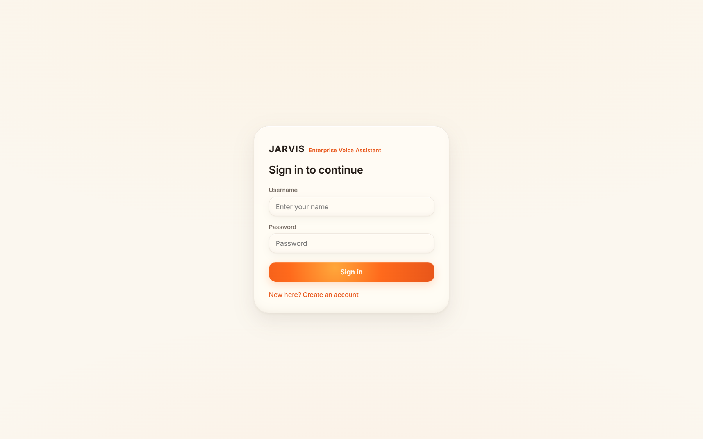
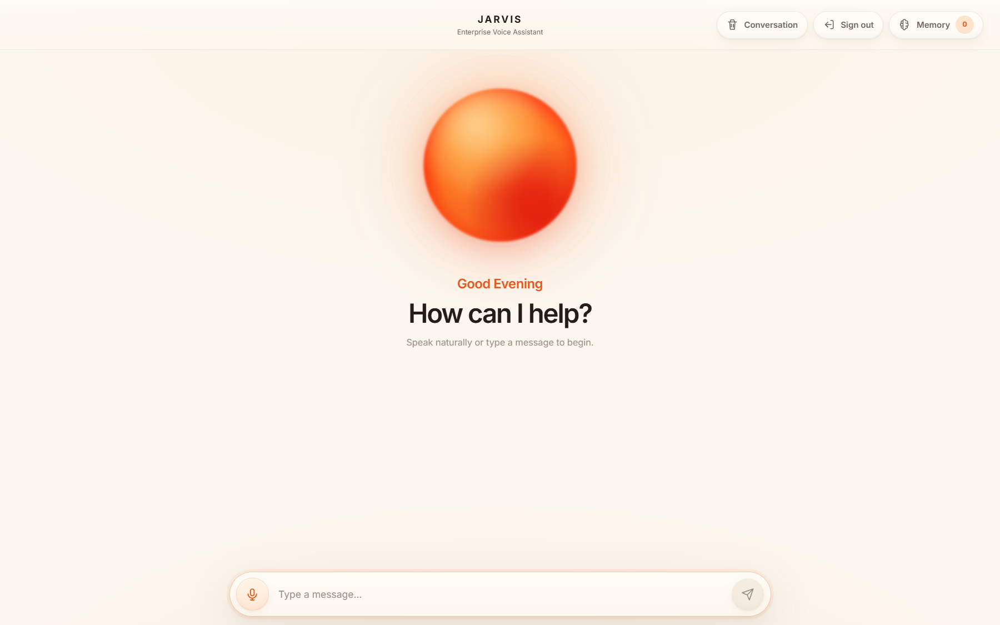
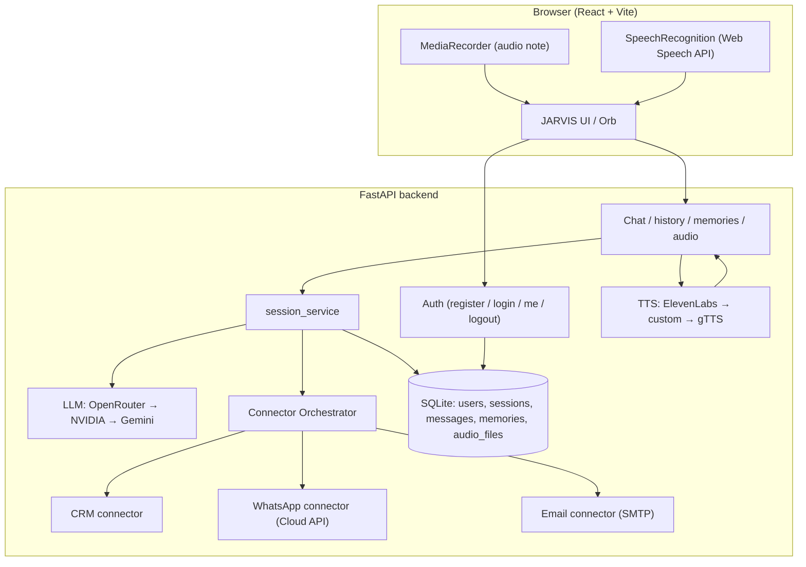

<div align="center">

# Enterprise Voice Assistant

**A voice-first AI assistant with persistent long-term memory, per-user accounts, a state-driven Solar-Lava JARVIS orb, and a modular business-connector layer (CRM → WhatsApp / Email).**

[](https://python.org)
[](https://fastapi.tiangolo.com)
[](https://react.dev)
[](https://vitejs.dev)
[](https://sqlite.org)

*Speak naturally. Be remembered. Take action.*

</div>

---

## ✨ Overview

A production-oriented, multi-provider voice assistant:

- **Accounts & user separation** — built-in login/register. Each user's chat history and long-term memory are isolated server-side via opaque bearer tokens (no client-trusted session ids).
- **Voice-first UI** — a JARVIS orb with distinct **Idle / Listening / Thinking / Speaking** states driven by *real* microphone and playback energy, with a contained liquid-wave interior and a **Solar Lava** theme.
- **Natural business actions** — ask in plain language to send a WhatsApp or email to a named contact. The LLM detects the intent; an **orchestrator** resolves the person via a **CRM** connector and sends via the **WhatsApp** or **Email** connector.
- **Resilient providers** — multi-provider fallbacks for LLM (OpenRouter → NVIDIA → Gemini) and TTS (ElevenLabs → custom → gTTS).

### Screenshots

| Sign in | Main screen |
|:---:|:---:|
|  |  |

---

## 🏗️ Architecture

### System architecture



### Voice / business-action request flow

```mermaid
sequenceDiagram
  participant U as User
  participant F as Frontend
  participant B as Backend
  participant L as LLM
  participant O as Orchestrator
  participant C as CRM
  participant W as WhatsApp / Email

  U->>F: speaks "Send Rahul a WhatsApp: the meeting moved to 4"
  F->>F: STT (Web Speech API) → transcript (kept internal)
  F->>B: POST /chat { message, response_mode, Bearer token }
  B->>B: auth → user session (per-user data scope)
  B->>L: prompt + memories + history
  L-->>B: { reply, action{ whatsapp_message, recipient, message } }
  B->>O: run_business_action(action)
  O->>C: resolve("Rahul") → phone/email
  O->>W: send_text(phone, message)   [or email.send]
  W-->>O: success / clean failure
  O-->>B: final user-facing result
  B->>TTS: generate reply audio (voice mode)
  B-->>F: { reply, audio_url, memories }
  F->>U: orb Speaking + live transcript + audio
  Note over F,U: User transcript is never rendered; only JARVIS speaks.
```

### Key design rules
- **Conversation layout** decides where the normal orb is shown (full orb when empty, hidden when the chat is scrollable).
- **Voice activity** temporarily overrides that layout and drives orb behavior (Listening → Thinking → Speaking → back to normal layout).
- The user's voice transcript is **internal only** — the UI renders a voice-note bubble, not the words. JARVIS's live transcript is revealed as it speaks.
- Connector/provider execution lives **behind the orchestrator**, never inside the LLM/prompt path.

---

## 🔐 Login / Auth & user separation

- **Flow:** `POST /auth/register` → account created + token → `GET /auth/me` → protected endpoints with `Authorization: Bearer <token>` → `POST /auth/logout` revokes the token.
- **Security:** passwords are salted **PBKDF2-HMAC-SHA256** (200k iterations); sessions are opaque, server-stored tokens. No API key is required to use auth.
- **User separation:** every data endpoint (`/chat`, `/history`, `/memories`, `/clear*`, `/audio`) resolves the token to a user and scopes by a server-derived `session_id` (`user:<id>`). Two users cannot read or clear each other's history or memories (covered by tests).
- **Multi-admin / multi-deployment:** different admins or deployments simply use different accounts (and their own `.env` keys); isolation is per-account and data is per-`assistant.db`.

---

## 🗂️ Module architecture

| Layer | Location | Responsibility |
|---|---|---|
| **Auth** | `app/api/auth.py`, `app/services/auth_service.py` | Register/login/logout/me, password hashing, bearer sessions. |
| **Chat API** | `app/api/chat.py` | Auth-guarded chat, history, memories, clear, audio, status. |
| **Session / flow** | `app/services/session_service.py` | Prompt build, LLM call, memory updates, single business-action bridge. |
| **LLM** | `app/services/llm_service.py` | OpenRouter → NVIDIA → Gemini fallback; strict JSON; generic errors. |
| **TTS** | `app/services/tts_service.py` | ElevenLabs → custom/OpenAI-compat → gTTS; partial-file cleanup. |
| **Memory** | `app/services/memory_service.py` | Long-term memory CRUD (per session/user). |
| **History** | `app/services/database_chat_history.py` | Conversation persistence (+ request mode). |
| **Connectors** | `app/connectors/*` | `base`, `crm_connector` (directory + REST), `whatsapp_connector`, `email_connector`, `orchestrator`. |
| **Config** | `app/core/config.py` | Robust env parsing, `.env` precedence, provider detection. |
| **DB** | `app/core/database.py` | SQLite schema + migrations. |
| **Frontend** | `frontend/src/*` | Auth screen, orb (`AudioVisualizer`), chat (`ChatWindow`), input + recording + STT (`ChatInput`), bubbles (`MessageBubble`), memory sidebar. |

### Connectors
- **CRM** — `CRM_PROVIDER=directory` (in-memory `CRM_CONTACTS` JSON) **or** `CRM_PROVIDER=rest` (a real CRM over HTTP, configured entirely by env vars). Field mapping uses configurable names plus common aliases (`name/full_name`, `phone/mobile`, `email/email_address`), so most CRMs work by setting base URL + key + endpoint only.
- **WhatsApp** — Meta **Cloud API** via stdlib `urllib` (no browser automation).
- **Email** — any **SMTP** provider (Gmail, Microsoft/Outlook, relay) via stdlib `smtplib`.

> **Unresolved decision (reported, not assumed):** which specific external CRM product to bind is a business choice. The code is provider-agnostic and **API-ready for `CRM_PROVIDER=rest`** — supply the endpoint + credentials + (if non-standard) field mappings in `.env`. No further code change is needed for a standard REST contact-search API.

---

## 🚀 Setup & run

### Prerequisites
| Requirement | Version |
|---|---|
| Python | 3.11+ |
| Node.js | 18+ |
| LLM API key | at least one of OpenRouter / NVIDIA / Gemini |
| Browser | Chrome or Edge for voice (Web Speech API) |

```bash
# 1. Clone
git clone https://github.com/Karan7505/Enterprise-Voice-Assistant.git
cd Enterprise-Voice-Assistant

# 2. Configure
cp .env.example .env          # Windows:  copy .env.example .env
#    → add at least one LLM key (+ optional TTS / connector keys)

# 3. Backend
python -m venv venv
.\venv\Scripts\activate       # Windows   (macOS/Linux: source venv/bin/activate)
pip install -r requirements.txt
python -m uvicorn app.main:app --reload --port 8000

# 4. Frontend (new terminal)
cd frontend
npm install
npm run dev
```

- API: **http://localhost:8000** (docs at `/docs`)
- UI: **http://localhost:5173**
- First use: create an account on the sign-in screen (or `POST /auth/register`).

The frontend talks to `http://localhost:8000` in development via `frontend/.env.development`. For a separate deployment, set `VITE_API_BASE_URL` at build time and `FRONTEND_URL` + `CORS_ORIGINS` on the backend; leave both empty/origin-matched when a reverse proxy serves them from one origin.

---

## 🔑 Environment variables

Copy `.env.example` → `.env`. In local development the root `.env` is authoritative (it overrides inherited shell values on each start); a deployment without a root `.env` uses its platform environment.

### Deployment / frontend origin
| Variable | Purpose | Default |
|---|---|---|
| `FRONTEND_URL` | Deployed frontend origin (also the OpenRouter referer) | `http://localhost:5173` |
| `CORS_ORIGINS` | Comma-separated CORS allowlist | `FRONTEND_URL` |

### Runtime limits
| Variable | Purpose | Default |
|---|---|---|
| `MAX_HISTORY_MESSAGES` | Recent messages sent to the LLM (`0` = all) | `10` |
| `AUDIO_MAX_AGE_SECONDS` | Age before generated `.mp3` files are cleaned | `3600` |

### LLM (provide at least one)
| Variable | Purpose | Default |
|---|---|---|
| `OPENROUTER_API_KEY` | OpenRouter key (provider 1) | — |
| `OPENROUTER_MODEL` | OpenRouter model | `google/gemini-2.0-flash-001` |
| `NVIDIA_API_KEY` | NVIDIA NIM key (provider 2) | — |
| `NVIDIA_MODEL` | NVIDIA model | `meta/llama-3.3-70b-instruct` |
| `GEMINI_API_KEY` | Google Gemini key (provider 3) | — |

### TTS (voice replies)
| Variable | Purpose | Default |
|---|---|---|
| `ELEVENLABS_API_KEY` | ElevenLabs key (provider 1) | — |
| `ELEVENLABS_VOICE_ID` | ElevenLabs voice | `myFdf83MJZVXe8yKeA6H` |
| `ELEVENLABS_MODEL_ID` | ElevenLabs model | `eleven_multilingual_v2` |
| `ELEVENLABS_STABILITY` | 0.0–1.0 | `0.62` |
| `ELEVENLABS_SIMILARITY_BOOST` | 0.0–1.0 | `0.78` |
| `ELEVENLABS_STYLE` | 0.0–1.0 | `0.08` |
| `ELEVENLABS_USE_SPEAKER_BOOST` | `true`/`false` | `true` |
| `ELEVENLABS_SPEED` | 0.7–1.2 | `1.0` |
| `TTS_API_KEY` | Custom OpenAI-compatible TTS key (provider 2) | — |
| `TTS_BASE_URL` | Custom TTS endpoint (blank = OpenAI default) | `https://api.openai.com/v1` |
| `TTS_MODEL` | Custom TTS model | `gpt-4o-mini-tts` |
| `TTS_VOICE` | Custom TTS voice | `ash` |
| `TTS_SPEED` | 0.25–4.0 | `1.0` |
| `TTS_INSTRUCTIONS` | Voice profile (sent only to `gpt-4o-mini-tts*`) | JARVIS delivery profile |
| *(no key)* | gTTS fallback (provider 3) — always tried last | — |

### Connectors (all optional)
| Variable | Purpose |
|---|---|
| `CRM_PROVIDER` | `directory` (default) or `rest` |
| `CRM_CONTACTS` | JSON array of contacts (directory provider) |
| `CRM_REST_BASE_URL` | REST CRM base URL |
| `CRM_REST_API_KEY` | REST CRM API key |
| `CRM_REST_AUTH_HEADER` | Auth header name (default `Authorization`) |
| `CRM_REST_AUTH_SCHEME` | Auth scheme (default `Bearer`) |
| `CRM_REST_SEARCH_PATH` | Contact-search path (default `/contacts/search`) |
| `CRM_REST_QUERY_PARAM` | Query param name (default `q`) |
| `CRM_REST_RESULTS_KEY` | JSON key holding the result list (default `results`) |
| `CRM_REST_TIMEOUT` | Request timeout seconds (default `10`) |
| `CRM_REST_NAME_FIELD` / `CRM_REST_PHONE_FIELD` / `CRM_REST_EMAIL_FIELD` | Field names (with common alias fallbacks) |
| `WA_TOKEN` | WhatsApp Cloud API permanent token |
| `WA_PHONE_NUMBER_ID` | WhatsApp Business phone-number ID |
| `WA_GRAPH_VERSION` | Graph API version (default `v19.0`) |
| `EMAIL_HOST` | SMTP server (e.g. `smtp.gmail.com`, `smtp.office365.com`) |
| `EMAIL_PORT` | SMTP port (default `587`) |
| `EMAIL_USERNAME` / `EMAIL_PASSWORD` | SMTP credentials (use an app password for Gmail/Microsoft 2FA) |
| `EMAIL_USE_TLS` | `true` = STARTTLS (default) |

`CRM_CONTACTS` (directory) example — people carry `phone`/`email`; groups carry `kind: "group"` + `members`:

```json
[
  {"name":"Rahul","phone":"+919812345678","email":"rahul@acme.com","role":"engineer"},
  {"name":"Priya","email":"priya@acme.com","role":"designer"},
  {"name":"Sales Team","kind":"group","members":["rahul@acme.com","priya@acme.com"]}
]
```

> Authentication needs **no env key** — accounts are created through the UI or the API. Provider/connector credentials are loaded from `.env` (in `.gitignore`), never hard-coded, and never sent to the frontend.

---

## 📁 Project structure

```
Enterprise-Voice-Assistant/
├── app/
│   ├── main.py                          # FastAPI app, CORS, lifespan (DB + audio init)
│   ├── api/
│   │   ├── auth.py                      # /auth/* + require_user dependency
│   │   └── chat.py                      # auth-guarded chat/history/memories/audio/status
│   ├── core/
│   │   ├── config.py                    # env loading + settings (LLM, TTS, connectors)
│   │   └── database.py                  # SQLite schema + migrations (incl. users/sessions)
│   ├── models/
│   │   └── chat_message.py              # ChatMessage (role, content, mode)
│   ├── prompts/
│   │   └── chat_prompt.py               # memory-aware prompt + business-action rules
│   ├── services/
│   │   ├── auth_service.py              # PBKDF2 + bearer sessions
│   │   ├── llm_service.py               # OpenRouter → NVIDIA → Gemini fallback
│   │   ├── tts_service.py               # ElevenLabs → OpenAI-compat → gTTS + cleanup
│   │   ├── session_service.py           # message flow, memory updates, action bridge
│   │   ├── memory_service.py            # long-term memory CRUD
│   │   ├── database_chat_history.py     # conversation history CRUD (+ mode)
│   │   └── context_builder.py           # loads memory context at session start
│   └── connectors/
│       ├── base.py                      # ActionResult / ActionCode
│       ├── crm_connector.py             # BaseCRM, DirectoryCRM, RestCRM
│       ├── whatsapp_connector.py        # WhatsApp Cloud API sender
│       ├── email_connector.py           # SMTP sender
│       └── orchestrator.py              # CRM → connector routing (single entry point)
├── frontend/
│   └── src/
│       ├── App.jsx                      # auth screen, state, API, audio playback, reset
│       ├── App.css / index.css          # Solar Lava + gel theme, orb + layout styles
│       └── components/
│           ├── AudioVisualizer.jsx      # JARVIS orb (idle/listen/think/speak + waves)
│           ├── ChatWindow.jsx           # scrollable message list + orb layout
│           ├── ChatInput.jsx            # textarea + MediaRecorder + SpeechRecognition
│           ├── MessageBubble.jsx        # text bubble or voice-note bubble
│           ├── MemorySidebar.jsx        # memory drawer (search, clear, reset)
│           └── Icon.jsx                 # thin-line SVG icon set
├── tests/                               # backend unittest suite
├── docs/screenshots/                    # README screenshots
├── .env.example                         # full env template (copy → .env)
└── requirements.txt                     # Python dependencies
```

---

## 📡 API

| Method | Endpoint | Auth | Description |
|---|---|:---:|---|
| `POST` | `/auth/register` | — | Create account → `{ token, user }`. |
| `POST` | `/auth/login` | — | Log in → `{ token, user }`. |
| `GET` | `/auth/me` | ✔ | Current user. |
| `POST` | `/auth/logout` | ✔ | Revoke the session token. |
| `POST` | `/chat` | ✔ | Send message → reply, optional `audio_url`, updated `memories`. `response_mode`: `text`/`voice`. |
| `GET` | `/history` | ✔ | The user's conversation history (each message includes `mode`). |
| `GET` | `/memories` | ✔ | The user's long-term memories. |
| `POST` | `/clear-chat` | ✔ | Clear history, keep memories. |
| `POST` | `/clear-memories` | ✔ | Clear memories, keep history. |
| `POST` | `/clear` | ✔ | Wipe the user's history + memories. |
| `GET` | `/status` | — | Health + active LLM/TTS providers and configured connectors. |
| `GET` | `/audio/{filename}` | ✔ | Stream a generated TTS file (owned by the user). |

---

## 🧪 Tests

```bash
# Backend (repo root, with the venv)
python -m unittest discover -s tests

# Frontend (frontend/)
npm run lint
npm run build
```

Backend suite (`tests/`): `test_auth.py` (register/login/logout, wrong password, **two-user data isolation**), `test_crm_rest.py` (REST CRM mapping, auth header, provider selection), `test_connectors.py` (CRM → WhatsApp / Email routing + failure states, mocked), `test_chat_response_modes.py`, `test_config_loading.py`, `test_tts_service.py`.

---

## ✅ Verification status

The project is verified **locally** to the extent possible without real third-party credentials. It is intentionally separated below so nothing is claimed that hasn't been run.

### Locally verified and working
- **Auth & user separation** — register/login/logout/me, wrong-password rejection, token revocation, and per-user history/memory isolation (unit tests + live local HTTP smoke of all `/auth` and guarded endpoints).
- **Memory & chat/history** — persistence, reload, clear-chat / clear-memories / full reset (unit tests + code paths exercised locally).
- **TTS fallback logic** — provider chain and partial-file cleanup verified with mocked providers (gTTS path is live-capable with no key; paid providers are exercised only as configured fallbacks in tests).
- **CRM abstraction & routing** — directory + REST providers, orchestrator CRM → WhatsApp/Email routing, and all failure states (mocked HTTP; no live CRM/WhatsApp/Email calls).
- **WhatsApp / Email connector logic** — request building, auth headers, response handling, and clean failure results (mocked; no live sends).
- **Frontend** — `npm run lint` and `npm run build` pass; UI (login screen, main screen, orb states, voice-note rendering, progressive transcript) reviewed against source and captured in the screenshots above.
- **Voice input (STT)** — uses the browser Web Speech API; code path verified, runtime behavior is browser-dependent (best in Chrome/Edge).

### Implemented but awaiting live API-key / production verification
- **LLM** — OpenRouter / NVIDIA / Gemini (needs a real key to serve real replies).
- **TTS** — ElevenLabs and custom/OpenAI-compatible (needs a real key; gTTS works with no key).
- **WhatsApp** — Meta Cloud API (needs `WA_TOKEN` + `WA_PHONE_NUMBER_ID` and a Business/Cloud-API number; template approval may be required).
- **Email** — SMTP (needs valid SMTP credentials; app password for Gmail/Microsoft 2FA).
- **CRM (rest)** — needs the chosen CRM's base URL + credentials (the **CRM product choice itself is the one unresolved decision**; see above).

**Bottom line:** after local verification, the only remaining steps to go live are **adding real credentials/config to `.env`** and **running live production tests** — **no code changes** are required for the LLM, TTS, auth, memory, history, or any standard REST/Cloud-API/SMTP connector.

---

## 🔒 Security notes
- Credentials load **only** from `.env` (gitignored) — never hard-coded, never exposed to the frontend.
- Passwords are salted PBKDF2; sessions are opaque server-stored tokens; logout revokes them.
- Provider errors are logged server-side; users get generic, provider-neutral messages.
- Data is scoped per authenticated user; `/audio` is ownership-checked.
